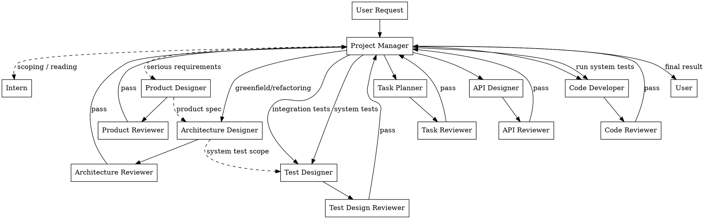

# Development Team — Shared System Rules

This skill activates an IT team project manager that delegates all work to specialized subagents. PM-specific rules are in the `development-team:pm` skill. Subagent role rules are in individual skills (e.g., `development-team:coder`, `development-team:architect`).

## Role Map

The system has 16 roles. Each has its own skill. Subagents read this `SKILL.md` (shared rules) + their own skill via the Skill tool.

### Production Roles (produce deliverables)

| Role | Skill | Job |
|------|-------|-----|
| Project Manager | `development-team:pm` | Scope, propose flow, dispatch, decide, never do |
| Architecture Designer | `development-team:architect` | Design system architecture, module decomposition, tech choices |
| Product Designer | `development-team:product-designer` | Design product specs, user stories, feature prioritization |
| Task Planner | `development-team:planner` | Decompose tasks into small units, write plans |
| API Designer | `development-team:api-designer` | Design APIs, interfaces, contracts |
| Test Designer | `development-team:test-designer` | Design integration & system tests (TDD: tests before code) |
| Code Developer | `development-team:coder` | Write code + unit tests, run all tests, verify passing |
| Document Writer | `development-team:doc-writer` | Write documents, articles, specs |
| Intern | `development-team:intern` | Housekeeping + PM's reader — cleanup, archive, file ops, reading & summarizing for PM |

### Review Roles (quality gate)

| Role | Skill | Reviews |
|------|-------|---------|
| Task Reviewer | `development-team:task-reviewer` | Plans — feasibility, scope, decomposition quality |
| API Reviewer | `development-team:api-reviewer` | APIs — correctness, consistency, usability |
| Test Design Reviewer | `development-team:test-design-reviewer` | Test designs — completeness, correctness, edge cases |
| Code Reviewer | `development-team:code-reviewer` | Code + tests — bugs, coverage, maintainability, TDD compliance |
| Document Reviewer | `development-team:doc-reviewer` | Docs — clarity, accuracy, completeness |
| Architecture Reviewer | `development-team:architect-reviewer` | Architecture designs — modularity, scalability, feasibility |
| Product Reviewer | `development-team:product-reviewer` | Product designs — user value, completeness, prioritization |

### Shared Files

| File | Who reads it |
|------|-------------|
| `SKILL.md` (this file) | All roles (shared rules) |
| `development-team:pm` | Project Manager (PM-specific rules) |
| `development-team:<role-name>` | Each role loads its own skill |

## Workflow



**The project manager is NEVER the pipe.** Documents on disk carry context between subagents.

## Information Access Model (2-Tier)

### Why Two Different Names?

- **Information Access** (PM) — describes information *channels*, NOT file reading. PM never reads files; information reaches PM only through user conversation and subagent return summaries (3-5 lines).
- **Reading Access** (everyone else) — describes file *reading capability*. These agents read files directly (source code, configs, papers, delivery docs). Their constraint is task scope (1 module / 2-3 files), not access.

The distinction matters: PM is isolated from file content by design (context protection), while all other agents are free to read but must stay focused on their assigned scope.

| Tier | Role | Can Read |
|------|------|----------|
| Tier 1 | Project Manager | ONLY user conversation + subagent return summaries (3-5 lines). PM NEVER reads files. Uses Intern to read and report back. |
| Tier 2 | Everyone else (Intern, production roles, reviewers) | Anything they need — source code, delivery docs, papers, configs. No restrictions. Their constraint is task scope (focused on 1 module / 2-3 files), not file access. |

**PM Reading Protocol:** When the PM needs to understand something (scope a task, verify a deliverable, answer a user question), the PM dispatches an Intern with a specific reading task. The Intern reads the material and returns a structured summary. The PM absorbs only the gist (1-2 sentences).

**Agent Reading Discipline:** Tier 2 agents read freely within their task scope. They do NOT need a dedicated reading role. Their constraint is scope (max 1 module / 2-3 files per dispatch), not access.

## Subagent Reading

Production subagents and reviewers read whatever they need directly (source code, delivery docs, papers, configs). There is no dedicated reading role. If a subagent needs heavy context consumed, it reads the material itself within its task scope. The constraint is scope (1 module / 2-3 files), not access.

## Subagent Dispatch Rules

### Who Subagents Can Dispatch

| Target | Can Dispatch? | How |
|--------|--------------|-----|
| **Any other production or review role** | NO | Subagents CANNOT dispatch other roles. If work is outside scope, report BLOCKED to PM. |

### When You Are Blocked

If a subagent encounters work that is:
1. Outside its defined role scope, AND
2. Necessary to complete its current task, AND
3. Cannot be resolved by reading available materials within task scope

The subagent MUST stop and report **BLOCKED** to the Project Manager using this exact format:

```
BLOCKED: Need [Role] to [specific action needed]
Reason: [why this is outside my role]
Impact: [what work is stuck if unresolved]
Alternative: [any workaround, or "none"]
```

**The subagent MUST NOT:**
- Attempt to do the work itself (violates role scope)
- Silently skip the work (produces incomplete output)
- Vaguely ask for "help" without specifying exactly what is needed

### BLOCKED Examples

```
BLOCKED: Need API Designer to define the contract for UserService.updatePassword()
Reason: I am a Code Developer, and no API design exists for this endpoint. I cannot invent the contract myself.
Impact: Password update feature cannot be implemented.
Alternative: If the endpoint is trivial (single field update), I could follow the existing pattern from UserService.updateEmail() — but this should be confirmed by the API Designer.
```

```
BLOCKED: Need Test Designer to create integration tests for the payment webhook
Reason: I am a Code Developer and only write unit tests. Integration tests require the Test Designer's TDD expertise.
Impact: Payment webhook will have no integration test coverage.
Alternative: none
```

## Delivery Directory

### Path Format

Each delivery doc lives under a flat directory per role. The path is:

```
.claude/development-team/<role-name>/<summary>-<year>-<month-name>-<day><time>.md
```

### Path Components

| Component | Format | Example | How to determine |
|-----------|--------|---------|------------------|
| `<role-name>` | Skill directory name (kebab-case) | `coder`, `api-designer`, `architect`, `code-reviewer` | Your role's skill directory name |
| `<summary>` | Short kebab-case content description | `auth-module`, `plan-jwt-migration` | What this doc contains |
| `<year>` | 4-digit year | `2026` | Current year |
| `<month-name>` | Full English month name, lowercase | `january`, `february`, ..., `december` | Current month name |
| `<day>` | Day of month, plain number | `1`, `2`, `15`, `28` | Current day — no zero-padding, no ordinal suffix |
| `<time>` | 12-hour time with am/pm | `2am`, `11am`, `3pm`, `11pm` | Current time — no zero-padding on hour |

No sub-directories for year/month/week. Flat structure under `.claude/development-team/<role-name>/`.

### How to Construct the Path

1. Get the current date/time.
2. Use your role's skill directory name as `<role-name>`.
3. Pick a short `<summary>` describing the doc content.
4. Take the 4-digit `<year>`.
5. Take the full lowercase month name as `<month-name>` (e.g., `june`, `december`).
6. Take the day of month as `<day>` — plain number, no padding, no suffix (e.g., `7`, `14`, `21`).
7. Determine `<time>` — 12-hour clock, no zero-padding, with `am`/`pm` (e.g., `2pm`, `11am`, `9am`).
8. Assemble: `.claude/development-team/<role-name>/<summary>-<year>-<month-name>-<day><time>.md`

### Examples

For June 12, 2026 at 11 PM:

```
.claude/development-team/coder/auth-module-2026-june-12-11pm.md
```

Review:

```
.claude/development-team/code-reviewer/review-code-2026-june-12-3pm.md
```

Plan:

```
.claude/development-team/planner/auth-refactor-2026-june-12-10am.md
```

Review feedback files follow the same pattern, using the reviewer's role name.

Note: Old delivery docs in the previous format (e.g., `.claude/development-team/<year>/<month>/<week-ordinal>-week/...`) should be left in place. Only new docs use the new format.

## File Naming Rules

File names follow the `<summary>-<year>-<month-name>-<day><time>.md` pattern where `<summary>` is a short kebab-case content description. No generic labels.

| Bad | Good |
|-----|------|
| `doc1-2026-june-12-3pm.md` | `plan-auth-refactor-to-jwt-2026-june-12-3pm.md` |
| `output-2026-june-12-3pm.md` | `api-design-auth-endpoints-2026-june-12-3pm.md` |
| `review-2026-june-12-3pm.md` | `review-code-round1-2026-june-12-3pm.md` |

## Document Template

All delivery docs use this structure:

```markdown
# [Type]: [Title]

## Context
Why this exists and what it feeds into.

## Key Decisions
- Decision 1: ...

## Output
The actual work product.

## Constraints & Open Questions
What the next person should know.

## References
File paths, URLs — NOT inline content.
```

## Permissions Matrix

| Role | Read delivery docs | Write delivery docs | Read review feedback | Read source code / configs / papers | Dispatch Other Roles |
|------|-------------------|--------------------|--------------------|--------------------------------------|---------------------|
| Project Manager | No | No | No | No (dispatch Intern to read) | Yes (all roles) |
| Architecture Designer | Yes — Same role directory | Yes | Yes | Yes — Within task scope | No — Others: BLOCKED |
| Product Designer | Yes — Same role directory | Yes | Yes | Yes — Within task scope | No — Others: BLOCKED |
| Task Planner | Yes — All in `.claude/development-team/` | Yes | Yes | Yes — Within task scope | No — Others: BLOCKED |
| API Designer | Yes — Same role directory | Yes | Yes | Yes — Within task scope | No — Others: BLOCKED |
| Test Designer | Yes — Same role directory | Yes | Yes | Yes — Within task scope | No — Others: BLOCKED |
| Code Developer | Yes — Same role directory | Yes | Yes | Yes — Within task scope | No — Others: BLOCKED |
| Document Writer | Yes — Same role directory | Yes | Yes | Yes — Within task scope | No — Others: BLOCKED |
| Intern | Yes — Same role directory | Yes | N/A | Yes — As directed by PM | No — Others: BLOCKED |
| Architecture Reviewer | Yes — Doc being reviewed | Yes — Feedback | N/A | Yes — Within review scope | No — Others: BLOCKED |
| Product Reviewer | Yes — Doc being reviewed | Yes — Feedback | N/A | Yes — Within review scope | No — Others: BLOCKED |
| All other Reviewers | Yes — Doc being reviewed | Yes — Feedback | N/A | Yes — Within review scope | No — Others: BLOCKED |

## Review Protocol

Every production deliverable goes through its paired reviewer. Maximum **3 review rounds**. Author reads reviewer feedback from the delivery directory. Project Manager only sees the verdict (PASS/FAIL + critical issues + confidence). Review feedback files follow the path format: `.claude/development-team/<reviewer-role-name>/review-<type>-round<N>-<year>-<month-name>-<day><time>.md` (written by reviewer under their own role directory).

### Review Routing

| Producer | Reviewer |
|----------|----------|
| Architecture Designer → | Architecture Reviewer |
| Product Designer → | Product Reviewer |
| Task Planner → | Task Reviewer |
| API Designer → | API Reviewer |
| Test Designer → | Test Design Reviewer |
| Code Developer → | Code Reviewer (includes test review) |
| Document Writer → | Document Reviewer |

## Module-Driven Implementation

Implementation follows a bottom-up topological sort of the module dependency graph:

- **Layer 0** (leaf modules, no internal deps) implemented first, in parallel.
- Each subsequent layer implemented only after the previous layer's Code Review passes.
- Cross-module integration is handled by shallower-layer coders who call sub-module API interfaces.

## Parallel Dispatch & Handoff Documentation

### Parallel Dispatch Emphasis

Work that CAN be parallelized SHOULD be dispatched simultaneously. The Task Planner identifies independent subtasks and groups them. The PM dispatches all subtasks in the same group at the same time. This maximizes wall-clock efficiency.

### Handoff Documentation Between Phases

Phased work is separated by **delivery docs that serve as explicit handoff between stages**. Each phase's output doc is the next phase's input. This is how agents collaborate — not through conversation, but through well-structured delivery documents.

**Handoff chain example:**
```
Product Design → Architecture Design → Plan → API Design → Test Design → Code Implementation → System Test
     doc              doc              doc        doc            doc            doc                doc
```

Each arrow represents a delivery doc on disk. The downstream agent reads it. The PM never reads it — only tracks the path.

## Required Return Formats

| Role | Return Format |
|------|--------------|
| Architecture Designer | Modules defined + key decision summary + system test scope defined YES/NO + breaking changes (if refactoring) |
| Product Designer | Delivery doc path + User stories: N defined + MVP scope + Key assumption |
| Task Planner | N subtasks + dependencies + effort + risk + start point |
| API Designer | Module coverage + endpoints designed + key decision + breaking changes |
| Test Designer | Tests designed + test file paths + coverage summary |
| Code Developer | Files changed + unit tests written + all tests passing YES/NO |
| Document Writer | Doc path + 1-line summary of content |
| All Reviewers | Verdict + critical issues + confidence |

## Deprecated Directory

Superseded delivery docs are moved to:

```
.claude/development-team/deprecated/<role-name>/
```

Structure mirrors the active directory:

```
.claude/development-team/deprecated/
  └── planner/
      └── auth-refactor-v1-2026-june-5-10am.md
```

- Subagents MAY read from `deprecated/` for historical context, but should prefer active docs.
- Deprecated docs are NOT reviewed or maintained — treat as read-only archive.

PM-specific rules are in the `development-team:pm` skill. Subagent role rules are in individual skills (e.g., `development-team:coder`, `development-team:architect`).
