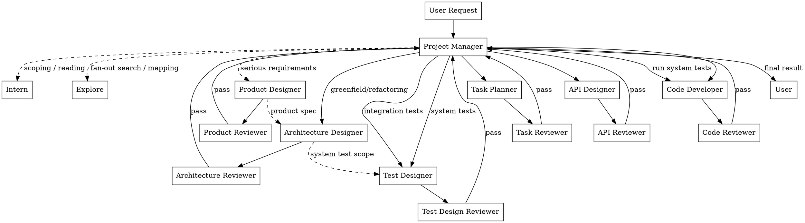

# Development Team — Shared System Rules

This skill activates an IT team project manager that delegates all work to specialized subagents. PM-specific rules are in the `development-team:pm` skill. Subagent roles are native Claude Code plugin agents (`agents/<role>.md`), dispatched by the PM via `subagent_type: development-team:<role>`.

## Architecture — Agent vs Skill vs Rule vs Hook

Every capability in this plugin falls into exactly one of four buckets. Knowing which bucket a new capability belongs to keeps the system coherent.

| Bucket | What it is | The question it answers | Example |
|--------|-----------|------------------------|---------|
| **Agent** | A role owning a *class of deliverables* + its own craft, failure-modes, and paired reviewer. The persistent "who." | *Who produces this?* | coder → code, architect → architecture |
| **Skill** | Reusable *methodology / process*, invocable at the moment it applies. The canonical single source for a method — the "how." | *How is this done?* | brainstorming, systematic-debugging, verification-before-completion, branch-finishing, using-git-worktrees, writing-skills, supervisory-polling |
| **Rule** | Mandatory *guidance* baked into an agent's definition (or these shared rules) — what a role must/may do. | *What must this role do?* | commit policy, the verification gate, scope limits |
| **Hook** | *Mechanical enforcement* of a non-negotiable hard rule, so it can't be violated by compliance failure. | *What must be impossible to bypass?* | the PM tool-restriction hook |

### Decision rule — where does a new capability go?

- Is it **methodology / process**? → **Skill** (invocable, single canonical source).
- Is it a **rule / guidance** tied to a role? → bake it into the **Agent** definition (or these shared rules).
- Is it a **non-negotiable hard rule** that must hold even under compliance failure? → **Hook**.

### Anti-patterns

- Don't create an **agent** whose entire job is one skill — that's **over-agenting**; it should be a skill invocation within an existing role.
- Don't create a **skill** that is really a mandatory rule — rules belong in agent definitions, not in invokable methodology.

## Role Map

The system has 20 roles. Each role is a native Claude Code plugin agent (`agents/<role>.md`). The PM dispatches a role with `subagent_type: development-team:<role>`. Dispatched subagents read this `SKILL.md` (shared rules) + their own agent definition.

### Production Roles (produce deliverables)

| Role | Agent | Job |
|------|-------|-----|
| Project Manager | `development-team:pm` | Scope, propose flow, dispatch, decide, never do |
| Architecture Designer | `development-team:architect` | Design system architecture, module decomposition, tech choices |
| Product Designer | `development-team:product-designer` | Design product specs, user stories, feature prioritization |
| Task Planner | `development-team:planner` | Decompose tasks into small units, write plans |
| API Designer | `development-team:api-designer` | Design APIs, interfaces, contracts |
| Test Designer | `development-team:test-designer` | Design integration & system tests (TDD: tests before code) |
| Code Developer | `development-team:coder` | Write code + unit tests, run all tests, verify passing |
| Document Writer | `development-team:doc-writer` | Write documents, articles, specs |
| Intern | `development-team:intern` | Housekeeping + PM's reader — cleanup, archive, file ops, reading & summarizing for PM |
| DevOps Engineer | `development-team:devops-engineer` | Infra-as-code, CI/CD, build configs, containers, deploy scripts, observability instrumentation |
| Data Engineer | `development-team:data-engineer` | DB schema changes, migrations, backfills, schema-evolution discipline, DB-layer query perf |
| Migrator | `development-team:migrator` | Repo-wide mechanical changes (codemods, bulk renames, deprecation sweeps); exempt from the 1-module rule |
| Explore | `development-team:explore` | Broad fan-out codebase search/mapping — "where does X live", touchpoint enumeration, locating suspects. Read-only to codebase; writes a map doc; no reviewer (findings factual) |

### Review Roles (quality gate)

| Role | Agent | Reviews |
|------|-------|---------|
| Task Reviewer | `development-team:task-reviewer` | Plans — feasibility, scope, decomposition quality |
| API Reviewer | `development-team:api-reviewer` | APIs — correctness, consistency, usability |
| Test Design Reviewer | `development-team:test-design-reviewer` | Test designs — completeness, correctness, edge cases |
| Code Reviewer | `development-team:code-reviewer` | Code + tests — bugs, coverage, maintainability, TDD compliance |
| Document Reviewer | `development-team:doc-reviewer` | Docs — clarity, accuracy, completeness |
| Architecture Reviewer | `development-team:architect-reviewer` | Architecture designs — modularity, scalability, feasibility |
| Product Reviewer | `development-team:product-reviewer` | Product designs — user value, completeness, prioritization |

### Shared Files

| File | Who reads it |
|------|-------------|
| `SKILL.md` (this file) | All roles (shared rules) |
| `development-team:pm` | Project Manager (PM-specific rules) |
| `agents/<role>.md` | Each role's native agent definition |

### Methodology Skills (cross-cutting, contextually invoked)

These skills are invokable via the Skill tool as `development-team:<name>`. They are NOT loaded at bootstrap — the PM (and, where relevant, subagents) invoke them contextually at the moment each discipline applies. They sit alongside the role map above as available methodology, not as roles.

| Skill | Invocation | One-line purpose | Trigger |
|-------|------------|------------------|---------|
| Brainstorming | `development-team:brainstorming` | Turn an ambiguous/creative request into a short, user-approved design BEFORE any production work. | PM invokes before proposing a workflow on ambiguous/creative tasks (open design space, greenfield, multi-option decision). Skipped for well-specified mechanical work. |
| Systematic Debugging | `development-team:systematic-debugging` | Force root-cause investigation before any fix, on any bug/test-failure/unexpected-behavior task. | PM references it in every bug-fix dispatch (Example G); Code Developer self-invokes during reproduction/root-cause. Code Reviewer enforces the contract as a PASS/FAIL gate. |
| Verification Before Completion | `development-team:verification-before-completion` | Require fresh verification evidence (run command, read output, confirm) before ANY completion/passing/fixed claim. | Every producer before a completion claim; Code Reviewer as a hard PASS/FAIL gate; PM treats satisfaction as a precondition to "deliver". |
| Branch Finishing | `development-team:branch-finishing` | Bring a feature branch to a mergeable state (tests green, rebased, conflicts resolved, PR-ready) before it is handed off or merged. | PM invokes when a task is complete and the branch must be closed out; Code Developer self-invokes before requesting review/merge. |
| Using Git Worktrees | `development-team:using-git-worktrees` | Isolate parallel work streams in separate git worktrees so concurrent branches do not clobber each other. | PM invokes when dispatching parallel work that would otherwise touch the same working tree; Code Developer / Migrator self-invoke when juggling multiple in-flight changes. |
| Writing Skills | `development-team:writing-skills` | Enforce authoring skills/rules as TDD-for-docs — baseline-failure artifact first, then the minimal doc that closes it, then loophole-closing re-test. | PM invokes before dispatching any "add/improve a dev-team skill or agent rule" task; Document Reviewer enforces the baseline-failure requirement as a PASS/FAIL gate (see `agents/doc-reviewer.md`). |
| Supervisory Polling | `development-team:supervisory-polling` | Make a polling cron SUPERVISE (check → escalate) rather than silently re-arm, closing the failure where a cron exists but nobody supervises. | PM invokes at the moment it is about to set a polling cron because the harness will NOT auto-resume it — e.g. the Stop hook just blocked it with pending todos, or it is deliberately waiting on external state / a person who may not return. |

**Who can invoke:** the PM (at the moments above) and subagents within their own scope (e.g., a Code Developer self-invokes systematic-debugging during a bug fix; a Code Reviewer applies verification-before-completion as a gate). They do NOT spawn agents and do NOT replace the role map — they are disciplines applied within the existing dispatch chain.

## Workflow



**The project manager is NEVER the pipe.** Documents on disk carry context between subagents.

**Methodology phases bracketing the diagram:**

- **Pre-plan (brainstorming):** for ambiguous/creative requests, `development-team:brainstorming` runs BEFORE the PM enters the dispatch chain above. The approved design feeds the PM's workflow proposal. The diagram topology itself is unchanged — brainstorming is a front door, not a new node.
- **Pre-deliver (verification gate):** `development-team:verification-before-completion` is a HARD gate before the final "Project Manager → User" edge. Every producer's completion return AND the PM's deliver must carry fresh command-output evidence, not assertions. The Code Reviewer's PASS already implies this; the gate makes it explicit at the deliver step.

## Information Access Model (2-Tier)

### Why Two Different Names?

- **Information Access** (PM) — describes information *channels*, NOT file reading. PM never reads files; information reaches PM only through user conversation and subagent return summaries (3-5 lines).
- **Reading Access** (everyone else) — describes file *reading capability*. These agents read files directly (source code, configs, papers, delivery docs). Their constraint is task scope (1 module / 2-3 files), not access.

The distinction matters: PM is isolated from file content by design (context protection), while all other agents are free to read but must stay focused on their assigned scope.

| Tier | Role | Can Read |
|------|------|----------|
| Tier 1 | Project Manager | ONLY user conversation + subagent return summaries (3-5 lines). PM NEVER reads files. Uses Intern to read and report back. |
| Tier 2 | Everyone else (Intern, production roles, reviewers) | Anything they need — source code, delivery docs, papers, configs. No restrictions. Their constraint is task scope (focused on 1 module / 2-3 files), not file access. |

**PM Reading Protocol:** When the PM needs to understand something (scope a task, verify a deliverable, answer a user question), the PM dispatches an Intern with a specific reading task. The Intern reads the material and returns a structured summary. The PM absorbs only the gist (1-2 sentences).

**Agent Reading Discipline:** Tier 2 agents read freely within their task scope. They do NOT need a dedicated reading role. Their constraint is scope (max 1 module / 2-3 files per dispatch), not access.

## Subagent Reading

Production subagents and reviewers read whatever they need directly (source code, delivery docs, papers, configs). There is no dedicated reading role. If a subagent needs heavy context consumed, it reads the material itself within its task scope. The constraint is scope (1 module / 2-3 files), not access.

## Subagent Dispatch Rules

### Who Subagents Can Dispatch

| Target | Can Dispatch? | How |
|--------|--------------|-----|
| **Any other production or review role** | NO | Subagents CANNOT dispatch other roles. If work is outside scope, report BLOCKED to PM. |

### When You Are Blocked

If a subagent encounters work that is:
1. Outside its defined role scope, AND
2. Necessary to complete its current task, AND
3. Cannot be resolved by reading available materials within task scope

The subagent MUST stop and report **BLOCKED** to the Project Manager using this exact format:

```
BLOCKED: Need [Role] to [specific action needed]
Reason: [why this is outside my role]
Impact: [what work is stuck if unresolved]
Alternative: [any workaround, or "none"]
```

**The subagent MUST NOT:**
- Attempt to do the work itself (violates role scope)
- Silently skip the work (produces incomplete output)
- Vaguely ask for "help" without specifying exactly what is needed

### BLOCKED Examples

```
BLOCKED: Need API Designer to define the contract for UserService.updatePassword()
Reason: I am a Code Developer, and no API design exists for this endpoint. I cannot invent the contract myself.
Impact: Password update feature cannot be implemented.
Alternative: If the endpoint is trivial (single field update), I could follow the existing pattern from UserService.updateEmail() — but this should be confirmed by the API Designer.
```

```
BLOCKED: Need Test Designer to create integration tests for the payment webhook
Reason: I am a Code Developer and only write unit tests. Integration tests require the Test Designer's TDD expertise.
Impact: Payment webhook will have no integration test coverage.
Alternative: none
```

## Delivery Directory

### Path Format

Each delivery doc lives under a flat directory per role. The path is:

```
.claude/development-team/<role-name>/<summary>-<month-name>-<day><ordinal>-<year>.md
```

### Path Components

| Component | Format | Example | How to determine |
|-----------|--------|---------|------------------|
| `<role-name>` | Skill directory name (kebab-case) | `coder`, `api-designer`, `architect`, `code-reviewer` | Your role's skill directory name |
| `<summary>` | Short kebab-case content description | `auth-module`, `plan-jwt-migration` | What this doc contains |
| `<month-name>` | Full English month name, lowercase | `january`, `february`, ..., `december` | Current month name |
| `<day>` | Day of month, plain number (no padding, no suffix) | `1`, `7`, `14`, `23` | Current day — no zero-padding, no ordinal suffix |
| `<ordinal>` | English ordinal suffix attached DIRECTLY to `<day>` (no hyphen between day and suffix) | `1st`, `2nd`, `3rd`, `4th`, `21st`, `23rd` | Ordinal rule: 1st, 2nd, 3rd; 4th–20th; 21st, 22nd, 23rd; 24th–30th; 31st. EXCEPTION: 11, 12, 13 always take `th` (11th, 12th, 13th) — never 11st/12nd/13rd |
| `<year>` | 4-digit year | `2026` | Current year |

No sub-directories for year/month/week. Flat structure under `.claude/development-team/<role-name>/`.

### How to Construct the Path

1. Use your role's skill directory name as `<role-name>`.
2. Pick a short `<summary>` describing the doc content.
3. Take the full lowercase month name as `<month-name>` (e.g., `june`, `december`).
4. Take the day of month as `<day>` — plain number, no zero-padding, no suffix (e.g., `7`, `14`, `21`).
5. Determine `<ordinal>` — the English ordinal suffix attached DIRECTLY to `<day>` with no hyphen: 1st, 2nd, 3rd; 4th–20th; 21st, 22nd, 23rd; 24th–30th; 31st. EXCEPTION: 11, 12, 13 always take `th` (11th, 12th, 13th) — never 11st/12nd/13rd. So day 1 → `1st`, day 12 → `12th`, day 21 → `21st`, day 23 → `23rd`.
6. Take the 4-digit `<year>`.
7. Assemble: `.claude/development-team/<role-name>/<summary>-<month-name>-<day><ordinal>-<year>.md`

### Examples

Code doc (June 14, 2026):

```
.claude/development-team/coder/auth-module-june-14th-2026.md
```

Review (June 1, 2026):

```
.claude/development-team/code-reviewer/review-code-june-1st-2026.md
```

Plan (June 23, 2026):

```
.claude/development-team/planner/auth-refactor-june-23rd-2026.md
```

Teen day (December 12, 2026 — note `12th`, never `12nd`):

```
.claude/development-team/doc-writer/readme-rewrite-december-12th-2026.md
```

Review feedback files follow the same pattern, using the reviewer's role name.

Note: Old delivery docs in either of the two previous formats should be left in place — the year/month/week format (e.g., `.claude/development-team/<year>/<month>/<week-ordinal>-week/...`) AND the superseded `<summary>-<year>-<month-name>-<day><time>.md` format (e.g., `auth-module-2026-june-12-23.md`). Only NEW docs use the current format.

## File Naming Rules

File names follow the `<summary>-<month-name>-<day><ordinal>-<year>.md` pattern where `<summary>` is a short kebab-case content description. No generic labels.

| Bad | Good |
|-----|------|
| `doc1-june-12th-2026.md` | `plan-auth-refactor-to-jwt-june-12th-2026.md` |
| `output-june-12th-2026.md` | `api-design-auth-endpoints-june-12th-2026.md` |
| `review-june-12th-2026.md` | `review-code-round1-june-12th-2026.md` |

## Document Template

All delivery docs use this structure:

```markdown
# [Type]: [Title]

## Context
Why this exists and what it feeds into.

## Key Decisions
- Decision 1: ...

## Output
The actual work product.

## Constraints & Open Questions
What the next person should know.

## References
File paths, URLs — NOT inline content.
```

## Permissions Matrix

| Role | Read delivery docs | Write delivery docs | Read review feedback | Read source code / configs / papers | Dispatch Other Roles |
|------|-------------------|--------------------|--------------------|--------------------------------------|---------------------|
| Project Manager | No | No | No | No (dispatch Intern to read) | Yes (all roles) |
| Architecture Designer | Yes — Same role directory | Yes | Yes | Yes — Within task scope | No — Others: BLOCKED |
| Product Designer | Yes — Same role directory | Yes | Yes | Yes — Within task scope | No — Others: BLOCKED |
| Task Planner | Yes — All in `.claude/development-team/` | Yes | Yes | Yes — Within task scope | No — Others: BLOCKED |
| API Designer | Yes — Same role directory | Yes | Yes | Yes — Within task scope | No — Others: BLOCKED |
| Test Designer | Yes — Same role directory | Yes | Yes | Yes — Within task scope | No — Others: BLOCKED |
| Code Developer | Yes — Same role directory | Yes | Yes | Yes — Within task scope | No — Others: BLOCKED |
| Document Writer | Yes — Same role directory | Yes | Yes | Yes — Within task scope | No — Others: BLOCKED |
| Intern | Yes — Same role directory | Yes | N/A | Yes — As directed by PM | No — Others: BLOCKED |
| Explore | Yes — Same role directory | Yes | N/A | Yes — Within task scope | No — Others: BLOCKED |
| Architecture Reviewer | Yes — Doc being reviewed | Yes — Feedback | N/A | Yes — Within review scope | No — Others: BLOCKED |
| Product Reviewer | Yes — Doc being reviewed | Yes — Feedback | N/A | Yes — Within review scope | No — Others: BLOCKED |
| All other Reviewers | Yes — Doc being reviewed | Yes — Feedback | N/A | Yes — Within review scope | No — Others: BLOCKED |

## Review Protocol

Every production deliverable goes through its paired reviewer. Maximum **3 review rounds**. Author reads reviewer feedback from the delivery directory. Project Manager only sees the verdict (PASS/FAIL + critical issues + confidence). Review feedback files follow the path format: `.claude/development-team/<reviewer-role-name>/review-<type>-round<N>-<month-name>-<day><ordinal>-<year>.md` (written by reviewer under their own role directory).

**Review diff scope (PM-owned):** when multiple mutating agents share a working tree, the PM MUST state each reviewer's exact file scope in the dispatch prompt, and reviewers MUST scope their diff to those files (`git diff -- <file>...`), never bare `git diff`. See `development-team:pm` → "Rule 4b: Scope Every Review's Diff to Its Target Files" for the full rule and the failure it closes.

### Review Routing

| Producer | Reviewer |
|----------|----------|
| Architecture Designer → | Architecture Reviewer |
| Product Designer → | Product Reviewer |
| Task Planner → | Task Reviewer |
| API Designer → | API Reviewer |
| Test Designer → | Test Design Reviewer |
| Code Developer → | Code Reviewer (includes test review) |
| Document Writer → | Document Reviewer |
| DevOps Engineer → | Code Reviewer |
| Data Engineer → | Code Reviewer |
| Migrator → | Code Reviewer |

## Self-Extension (authoring skills / agent rules)

Authoring or editing skills or agent rules follows the `writing-skills` skill (TDD-for-docs). That skill defines the Iron Law, the RED→GREEN→REFACTOR cycle, and what a valid baseline-failure artifact IS — invoke `development-team:writing-skills` for the methodology.

## Module-Driven Implementation

Implementation follows a bottom-up topological sort of the module dependency graph:

- **Layer 0** (leaf modules, no internal deps) implemented first, in parallel.
- Each subsequent layer implemented only after the previous layer's Code Review passes.
- Cross-module integration is handled by shallower-layer coders who call sub-module API interfaces.

## Parallel Dispatch & Handoff Documentation

### Parallel Dispatch Emphasis

Work that CAN be parallelized SHOULD be dispatched simultaneously. The Task Planner identifies independent subtasks and groups them. The PM dispatches all subtasks in the same group at the same time. This maximizes wall-clock efficiency.

**Non-blocking by default.** The PM dispatches production work with `run_in_background: true` and acts as an event-driven scheduler: each task completion and each review PASS is an event that unlocks the next dependent batch (when one exists). See `development-team:pm` → "Event-Driven Non-Blocking Dispatch" for the full callback loop. Handoff docs on disk remain the inter-phase pipe; the async scheduler reacts to their completion instead of blocking on it.

### Handoff Documentation Between Phases

Phased work is separated by **delivery docs that serve as explicit handoff between stages**. Each phase's output doc is the next phase's input. This is how agents collaborate — not through conversation, but through well-structured delivery documents.

**Handoff chain example:**
```
Product Design → Architecture Design → Plan → API Design → Test Design → Code Implementation → System Test
     doc              doc              doc        doc            doc            doc                doc
```

Each arrow represents a delivery doc on disk. The downstream agent reads it. The PM never reads it — only tracks the path.

### Backgrounding Long-Running Bash Commands

Any Tier-2 subagent that runs a long command via Bash (training, compilation, builds, long test suites, large downloads, installs) should launch it with `run_in_background: true` so the user can watch live progress, then read the result when it exits. Foreground is fine only for quick commands. See the role's native agent definition (e.g., `agents/coder.md`) for the detailed pattern. (The PM does not run Bash, so this applies to production subagents and Intern.)

## Required Return Formats

| Role | Return Format |
|------|--------------|
| Architecture Designer | Modules defined + key decision summary + system test scope defined YES/NO + breaking changes (if refactoring) |
| Product Designer | Delivery doc path + User stories: N defined + MVP scope + Key assumption |
| Task Planner | N subtasks + dependencies + effort + risk + start point |
| API Designer | Module coverage + endpoints designed + key decision + breaking changes |
| Test Designer | Tests designed + test file paths + coverage summary |
| Code Developer | Files changed + unit tests written + all tests passing YES/NO |
| Document Writer | Doc path + 1-line summary of content |
| Explore | Map doc path + question answered + entry points + hit count + pattern + confidence |
| All Reviewers | Verdict + critical issues + confidence |

## Deprecated Directory

Superseded delivery docs are moved to:

```
.claude/development-team/deprecated/<role-name>/
```

Structure mirrors the active directory:

```
.claude/development-team/deprecated/
  └── planner/
      └── auth-refactor-v1-june-5th-2026.md
```

- Subagents MAY read from `deprecated/` for historical context, but should prefer active docs.
- Deprecated docs are NOT reviewed or maintained — treat as read-only archive.

PM-specific rules are in the `development-team:pm` skill. Subagent roles are native Claude Code plugin agents (`agents/<role>.md`, e.g., `agents/coder.md`, `agents/architect.md`), dispatched via `subagent_type: development-team:<role>`.
