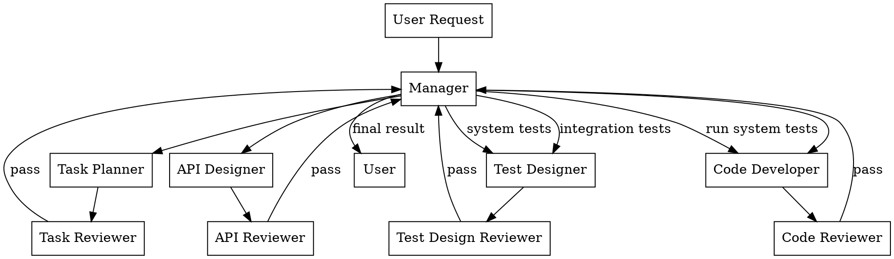

# System Overview — Shared by All Roles

This document defines the delivery system that all participants share.

## Workflow



**The manager is NEVER the pipe.** Documents on disk carry context between subagents.

## Subagent Calling Subagent

Production subagents may dispatch a **Summarizer** when they need heavy context consumed (reading papers, scanning codebases, analyzing projects). The Summarizer writes findings to disk and returns a summary to the calling subagent — NOT to the manager.

## Delivery Directory

### Path Format

```
.claude/the-company/<task-profile>-<YYYY-MM-DD>-<HHMMSS>/
```

- `<task-profile>`: Short kebab-case task description (e.g., `css-migration`, `auth-refactor`)
- `<YYYY-MM-DD>`: Date the task was created
- `<HHMMSS>`: Time the task was created (24h)

### Example

```
.claude/the-company/auth-refactor-2026-06-07-143022/
  ├── plan-auth-refactor-to-jwt.md
  ├── review-task-round1.md
  ├── api-design-auth-endpoints.md
  ├── review-api-round1.md
  ├── code-auth-module-impl.md
  ├── review-code-round1.md
  ├── test-auth-module.md
  ├── review-test-round1.md
  └── summary-research-oauth2-vs-jwt.md
```

## File Naming Rules

File names MUST be **content summaries in kebab-case**. No generic labels.

| ❌ Bad | ✅ Good |
|--------|---------|
| `doc1.md` | `plan-auth-refactor-to-jwt.md` |
| `output.md` | `api-design-auth-endpoints.md` |
| `review.md` | `review-code-round1.md` |

## Document Template

All delivery docs use this structure:

```markdown
# [Type]: [Title]

## Context
Why this exists and what it feeds into.

## Key Decisions
- Decision 1: ...

## Output
The actual work product.

## Constraints & Open Questions
What the next person should know.

## References
File paths, URLs — NOT inline content.
```

## Permissions Matrix

| Role | Read delivery docs | Write delivery docs | Read review feedback | Dispatch Summarizer | Consume heavy context |
|------|-------------------|--------------------|--------------------|--------------------|-----------------------|
| Manager | ❌ | ❌ | ❌ | ✅ (user questions only) | ❌ |
| Task Planner | ✅ All in `.claude/the-company/` | ✅ | ✅ | ✅ | As needed |
| API Designer | ✅ Same dir | ✅ | ✅ | ✅ | As needed |
| Test Designer | ✅ Same dir | ✅ | ✅ | ✅ | As needed |
| Code Developer | ✅ Same dir | ✅ | ✅ | ✅ | As needed |
| Document Writer | ✅ Same dir | ✅ | ✅ | ✅ | As needed |
| Intern | ✅ Same dir | ✅ | N/A | ❌ | Minimal — list/check only |
| Summarizer | ✅ Same dir | ✅ | N/A | ❌ | ✅ This IS the job |
| All Reviewers | ✅ Doc being reviewed | ✅ Feedback | N/A | ✅ | Only the deliverable |

## Review Protocol

- Every production deliverable goes through its paired reviewer.
- Maximum **3 review rounds**.
- Author reads reviewer feedback from the delivery directory.
- Manager only sees the verdict (PASS/FAIL + critical issues + confidence).
- Review feedback files: `review-<type>-round-N.md`

## Deprecated Directory

Superseded delivery directories are moved to:

```
.claude/the-company/deprecated/
```

Structure mirrors the active directory:

```
.claude/the-company/deprecated/
  ├── auth-refactor-2026-06-05-101500/
  │   ├── plan-auth-refactor-v1.md
  │   └── review-task-round1.md
  └── css-migration-2026-06-01-090000/
      ├── research-css-frameworks.md
      └── plan-migration-v1.md
```

- Subagents MAY read from `deprecated/` for historical context, but should prefer active docs.
- Deprecated docs are NOT reviewed or maintained — treat as read-only archive.
