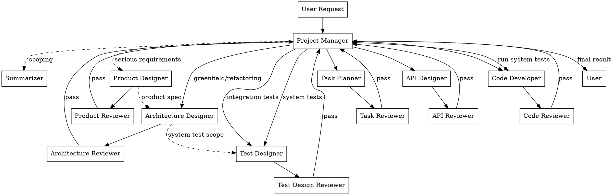

# System Overview — Shared by All Roles

This document defines the delivery system that all participants share.

## Workflow



**The project manager is NEVER the pipe.** Documents on disk carry context between subagents.

## Universal Rule: No Raw Source Code Access

- NO agent in the system reads raw source code directly.
- When any agent needs to understand existing code, the Project Manager dispatches a Summarizer to read the code and return a structured summary.
- Agents receive: API interface definitions, architecture summaries, Summarizer-provided code summaries. They do NOT receive: raw source files, git diffs, file contents.
- Exception: Code Developers read their OWN module's files (files they are actively editing). They do NOT read other modules' files.

## Subagent Calling Subagent

Production subagents may dispatch a **Summarizer** when they need heavy context consumed (reading papers, scanning codebases, analyzing projects). The Summarizer writes findings to disk and returns a summary to the calling subagent — NOT to the project manager.

## Delivery Directory

### Path Format

Each delivery doc lives in a time-based directory hierarchy. The path is:

```
.claude/development-team/<year>/<month>/<week-ordinal>-week/<agentname>/<summary>-<hour><ampm>-<day><ordinal>.md
```

### Path Components

| Component | Format | Example | How to determine |
|-----------|--------|---------|------------------|
| `<year>` | 4-digit year | `2026` | Current year |
| `<month>` | 2-digit month | `06` | Current month (zero-padded) |
| `<week-ordinal>-week` | Ordinal week of month | `1st-week`, `2nd-week`, `3rd-week`, `4th-week`, `5th-week` | **NOT ISO week number** — count which week of the current month (1st through 5th), append `-week` |
| `<agentname>` | Role name in kebab-case | `coder`, `api-designer`, `architect` | Your role name |
| `<summary>` | Short kebab-case content description | `auth-module`, `plan-jwt-migration` | What this doc contains |
| `<hour><ampm>` | 12-hour clock with am/pm suffix | `07am`, `02pm`, `11am` | Current hour in 12-hour format + `am` or `pm` |
| `<day><ordinal>` | Day of month with English ordinal suffix | `1st`, `2nd`, `3rd`, `14th`, `21st`, `22nd`, `23rd` | Current day + `st`/`nd`/`rd`/`th` |

### Ordinal Suffix Rules

- **st**: 1, 21, 31
- **nd**: 2, 22
- **rd**: 3, 23
- **th**: 4-20, 24-30

### How to Construct the Path

1. Get the current date/time.
2. Determine `<week-ordinal>-week`: which week of the month is it? (1st = days 1-7, 2nd = days 8-14, 3rd = days 15-21, 4th = days 22-28, 5th = days 29-31). This is the week number within the current month, **not** the ISO week number of the year. Append `-week` (e.g., `1st-week`).
3. Use your role name as `<agentname>`.
4. Pick a short `<summary>` describing the doc content.
5. Determine `<hour><ampm>`: convert the current hour to 12-hour format and append `am` or `pm` (e.g., 14:00 becomes `02pm`, 9:00 becomes `09am`).
6. Determine `<day><ordinal>`: take the current day of month and append the English ordinal suffix (e.g., 7 becomes `7th`, 14 becomes `14th`, 21 becomes `21st`).
7. Assemble: `.claude/development-team/<year>/<month>/<week-ordinal>-week/<agentname>/<summary>-<hour><ampm>-<day><ordinal>.md`

### Example

For June 7, 2026 at 2:00 PM, during the 1st week of June, an API Designer designing auth endpoints:

```
.claude/development-team/2026/06/1st-week/api-designer/auth-endpoints-02pm-7th.md
```

A full task producing multiple docs might look like:

```
.claude/development-team/2026/06/1st-week/
  ├── product-designer/
  │   └── user-app-10am-7th.md
  ├── architect/
  │   └── modular-structure-11am-7th.md
  ├── planner/
  │   └── auth-refactor-to-jwt-12pm-7th.md
  ├── api-designer/
  │   └── auth-endpoints-01pm-7th.md
  ├── test-designer/
  │   └── auth-integration-tests-02pm-7th.md
  ├── coder/
  │   └── auth-module-impl-03pm-7th.md
  └── summarizer/
      └── research-oauth2-vs-jwt-10am-7th.md
```

Review feedback files follow the same pattern, using the reviewer's role name:

```
.claude/development-team/2026/06/1st-week/code-reviewer/review-code-round1-03pm-7th.md
```

## File Naming Rules

File names follow the `<summary>-<hour><ampm>-<day><ordinal>.md` pattern where `<summary>` is a short kebab-case content description. No generic labels.

| ❌ Bad | ✅ Good |
|--------|---------|
| `doc1-02pm-7th.md` | `plan-auth-refactor-to-jwt-02pm-7th.md` |
| `output-02pm-7th.md` | `api-design-auth-endpoints-02pm-7th.md` |
| `review-02pm-7th.md` | `review-code-round1-02pm-7th.md` |


## Document Template

All delivery docs use this structure:

```markdown
# [Type]: [Title]

## Context
Why this exists and what it feeds into.

## Key Decisions
- Decision 1: ...

## Output
The actual work product.

## Constraints & Open Questions
What the next person should know.

## References
File paths, URLs — NOT inline content.
```

## Permissions Matrix

| Role | Read delivery docs | Write delivery docs | Read review feedback | Dispatch Summarizer | Consume heavy context |
|------|-------------------|--------------------|--------------------|--------------------|-----------------------|
| Project Manager | ❌ | ❌ | ❌ | ✅ (user questions only) | ❌ |
| Architecture Designer | ✅ Same date hierarchy | ✅ | ✅ | ✅ | As needed |
| Product Designer | ✅ Same date hierarchy | ✅ | ✅ | ✅ | As needed |
| Task Planner | ✅ All in `.claude/development-team/` | ✅ | ✅ | ✅ | As needed |
| API Designer | ✅ Same date hierarchy | ✅ | ✅ | ✅ | As needed |
| Test Designer | ✅ Same date hierarchy | ✅ | ✅ | ✅ | As needed |
| Code Developer | ✅ Same date hierarchy | ✅ | ✅ | ✅ | As needed |
| Document Writer | ✅ Same date hierarchy | ✅ | ✅ | ✅ | As needed |
| Intern | ✅ Same date hierarchy | ✅ | N/A | ❌ | Minimal — list/check only |
| Summarizer | ✅ Same date hierarchy | ✅ | N/A | ❌ | ✅ This IS the job |
| Architecture Reviewer | ✅ Doc being reviewed | ✅ Feedback | N/A | ✅ | Only the deliverable |
| Product Reviewer | ✅ Doc being reviewed | ✅ Feedback | N/A | ✅ | Only the deliverable |
| All other Reviewers | ✅ Doc being reviewed | ✅ Feedback | N/A | ✅ | Only the deliverable |

## Review Protocol

- Every production deliverable goes through its paired reviewer.
- Maximum **3 review rounds**.
- Author reads reviewer feedback from the delivery directory.
- Project Manager only sees the verdict (PASS/FAIL + critical issues + confidence).
- Review feedback files: `review-<type>-round<N>-<hour><ampm>-<day><ordinal>.md` (written by reviewer under their own agent directory)

## Module-Driven Implementation

Implementation follows a bottom-up topological sort of the module dependency graph:

- **Layer 0** (leaf modules, no internal deps) implemented first, in parallel.
- Each subsequent layer implemented only after the previous layer's Code Review passes.
- Cross-module integration is handled by shallower-layer coders who call sub-module API interfaces.

## Deprecated Directory

Superseded delivery docs are moved to:

```
.claude/development-team/deprecated/<year>/<month>/<week-ordinal>-week/<agentname>/
```

Structure mirrors the active directory:

```
.claude/development-team/deprecated/
  └── 2026/
      └── 06/
          └── 1st-week/
              ├── planner/
              │   └── auth-refactor-v1-10am-5th.md
              └── summarizer/
                  └── research-css-frameworks-09am-1st.md
```

- Subagents MAY read from `deprecated/` for historical context, but should prefer active docs.
- Deprecated docs are NOT reviewed or maintained — treat as read-only archive.
